# Falcon-8: Processador RISC-V de 8 bits

O **Falcon-8** é um processador monociclo desenvolvido para a disciplina de Arquitetura de Computadores. Ele utiliza uma filosofia **RISC inspirada no RISC-V**, adaptada para uma arquitetura de 16 bits (instrução) com palavra de dados de 8 bits. O projeto foi aplicado no desenvolvimento de um **Sistema de Frenagem Inteligente (SFI)**, focado em controle embarcado de tempo real. A principal meta foi garantir que o hardware processasse decisões críticas de segurança em menos de 5ms.

## Especificações Técnicas

| Característica | Especificação | Justificativa |
| :--- | :--- | :--- |
| **Arquitetura** | RISC-V simplificado | Instruções simples = execução rápida e determinística. |
| **Palavra de dados** | 8 bits | Suficiente para valores de sensores e atuadores (0-255). |
| **Instrução** | 16 bits | Permite codificar Opcode + 3 Registradores + Funct. |
| **Registradores** | 8 registradores (R0-R7) | Reduz a complexidade do banco de registradores e do hardware. |
| **Memória de dados** | 256 bytes | Endereçamento otimizado de 8 bits (0x00 a 0xFF). |
| **Memória de instruções** | 512 bytes | Suporta até 256 instruções (8 bits de endereço × 2 bytes). |
| **Clock** | 50 MHz | Ciclo de 20ns, ideal para resposta rápida em tempo real. |
| **Custo Estimado** | US$ 1.20 | Altamente viável para produção em larga escala (monociclo). |

## Conjunto de Instruções

O Falcon-8 trabalha com instruções de 16 bits divididas nos seguintes tipos:

- **Tipo R:** Operações lógicas e aritméticas entre registradores.
- **Tipo I:** Operações com valores imediatos e carregamento de memória (`LW`).
- **Tipo S:** Escrita em memória (`SW`).
- **Tipo B:** Desvios condicionais (`BEQ`, `BNE`, `BLT`).
- **Tipo J:** Desvios incondicionais (`JAL`)

### 1. Instruction Format (Formatação)
Definição da largura dos campos para cada tipo de instrução (R, I, S, B, J).
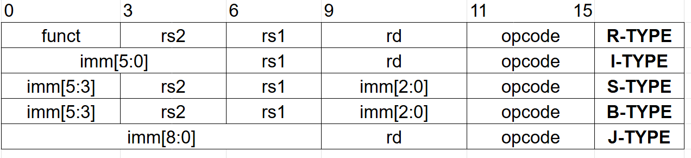

### 2. Instructions Opcode
Mapeamento dos códigos de operação que definem a classe da instrução.
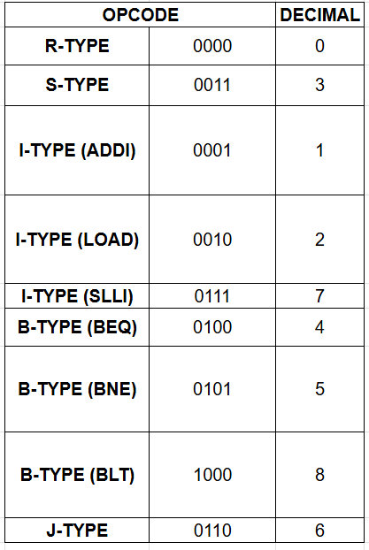

### 3. Instructions Funct
Lógica de seleção utilizada para diferenciar instruções que compartilham o mesmo Opcode.
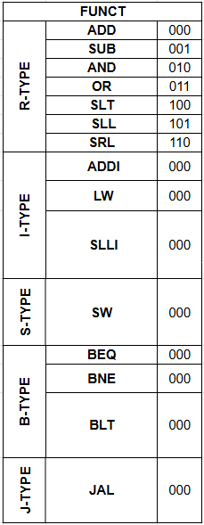

### 4. Immediate Selector (IMM_SEL)
Módulo responsável pela extração e extensão de sinal dos valores imediatos.
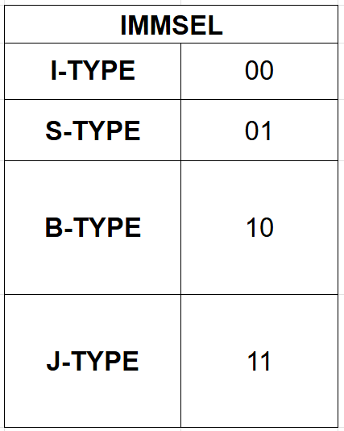

## 🏗️ Implementação Completa (Main)

Abaixo apresento a visão geral do processador **Falcon-8** integrado. Este módulo principal (Main) conecta os 7 componentes explicados anteriormente, formando o datapath monociclo completo. Nesta visualização, é possível observar o fluxo de dados desde a busca da instrução no **Instruction Fetch**, passando pela decodificação e execução na **ULA**, até o armazenamento final na **Data Memory**.

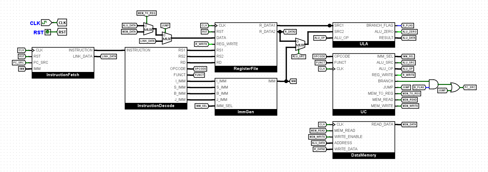

### 1. Instruction Fetch (Busca)
Responsável por gerenciar o **PC (Program Counter)** e buscar a próxima instrução na memória.
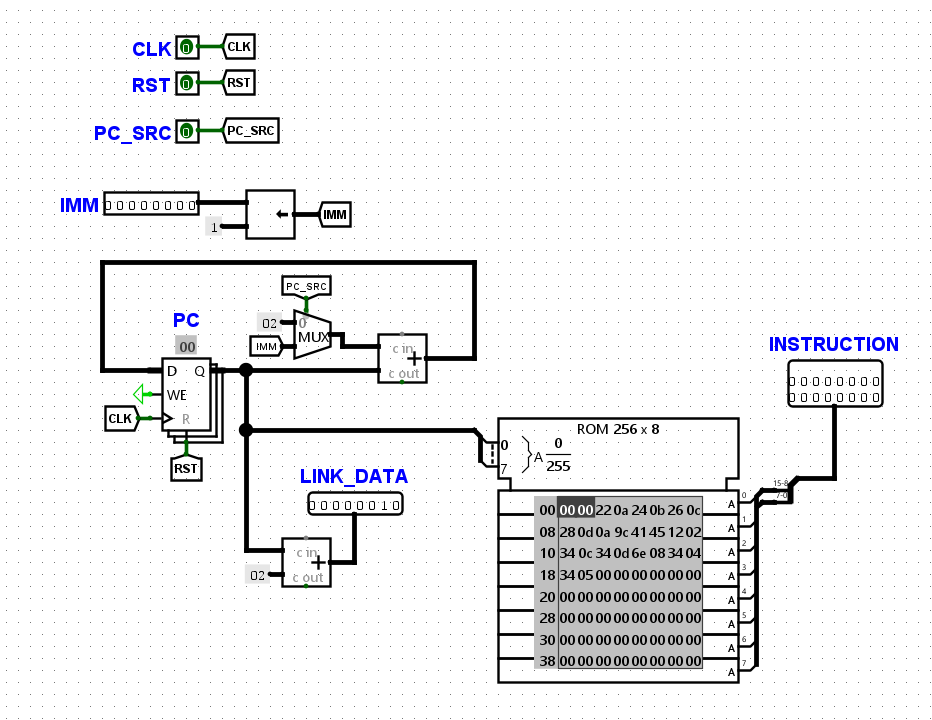

### 2. Instruction Decode (Decodificação)
Separa os campos da instrução de 16 bits (Opcode, Rd, Rs1, Rs2 e Funct).
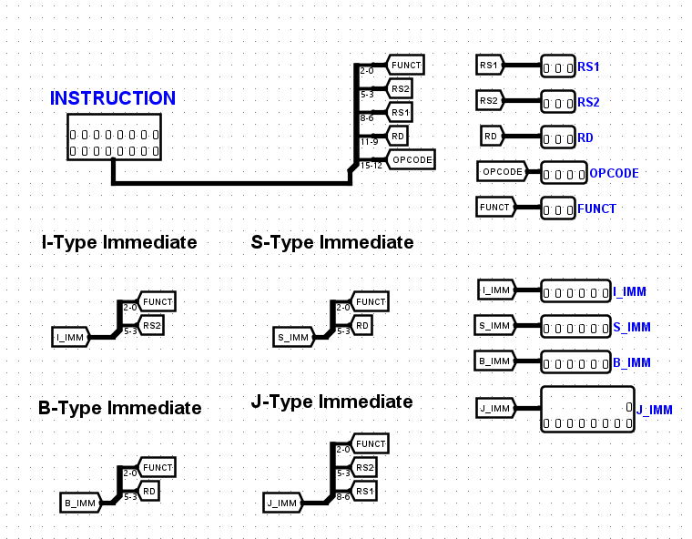

### 3. Unidade de Controle (UC)
O "cérebro" do processador que ativa os sinais de controle baseados no Opcode.
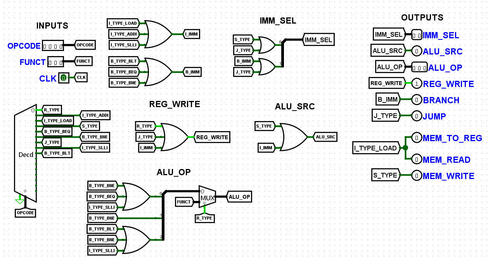

### 4. Register File (Banco de Registradores)
Armazena os valores temporários e de cálculo nos 8 registradores de 8 bits.
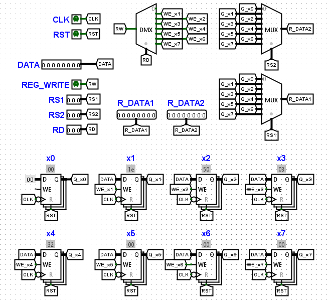

### 5. Immediate Generator (Imm Gen)
Extrai e estende os valores constantes (imediatos) das instruções Tipo-I, S e B.
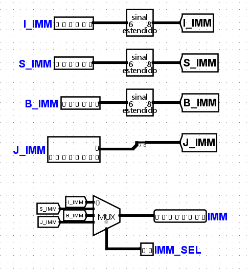

### 6. ULA (Unidade Lógica e Aritmética)
Executa as operações matemáticas e lógicas centrais do sistema.
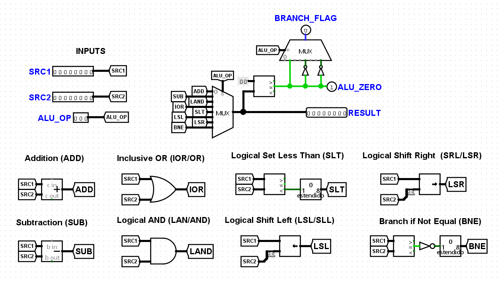

### 7. Data Memory
Interface de leitura e escrita para armazenamento persistente de dados e sensores.
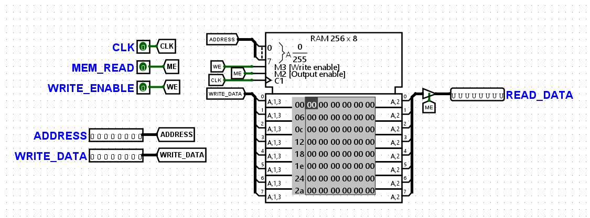

## 🚦 Sistema de Frenagem Inteligente (SFI)
O SFI monitora os sensores e decide o nível de frenagem necessário.

### 📥 Mapeamento de Memória (Entradas e Saídas)
| Endereço | Descrição | Atuador/Sensor | Valor Exemplo |
| :--- | :--- | :--- | :--- |
| **0x10** | Distância Frontal | Ultrassônico | 2m |
| **0x11** | Velocidade Atual | Hall Effect | 60 km/h |
| **0x12** | Limite de Segurança | Configuração | 3m |
| **0x13** | Velocidade Máxima | Configuração | 40 km/h |
| **0x20** | **Comando de Freio** | Atuador Freio | 0 (OFF), 1 (Normal), 2 (Emergência) |
| **0x21** | **Status do LED** | Painel/Dashboard | 0 (Verde), 1 (Amarelo), 2 (Vermelho) |

---

## 🧪 Validação e Casos de Teste (Módulo 1)

Para garantir a confiabilidade do sistema de frenagem, o processador foi submetido aos 5 casos de teste obrigatórios. Para cada cenário, foi desenvolvido um código Assembly específico e um arquivo de imagem de memória correspondente.

### Metodologia de Teste
1. O código Assembly no **RARS**.
2. O binário foi carregado na **Data Memory** do Logisim.
3. O processador executou a lógica e o resultado foi conferido no endereço `0x20` (Saída de Freio).

| Caso | Cenário | Entrada (Dist/Vel) | Saída Esperada (Freio)
| :--- | :--- | :--- | :--- 
| **1** | Emergência | 2m / 60km/h | **2 (Emergência)** 
| **2** | Normal | 50m / 40km/h | **0 (Desligado)** 
| **3** | Alerta | 2m / 20km/h | **1 (Normal)**
| **4** | Limite Exato | 3m / 40km/h | **1 (Normal)**
| **5** | Alta Velocidade | 30m / 80km/h | **0 (Desligado)** 

## 🔧 Ferramentas Utilizadas
* **Logisim Evolution:** Utilizado para o design digital do hardware, desde as portas lógicas da ULA até a integração do Datapath.
* **RARS:** Utilizado para escrever, depurar e gerar o código binário do sistema SFI.

---

*Projeto desenvolvido para a disciplina de Arquitetura de Computadores.*